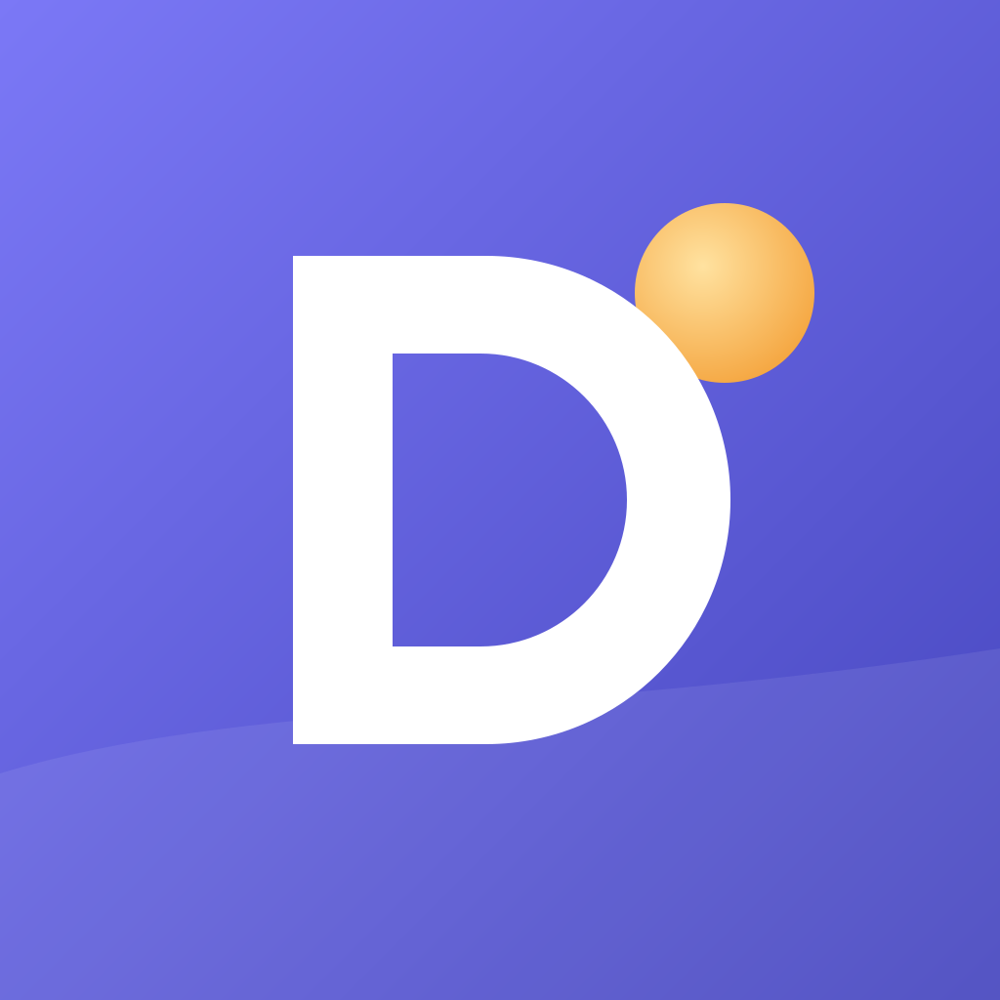

<p align="center"></p>

<h1 align="center">Dearth</h1>

<p align="center">
A family command center for wall-mounted touchscreens.<br>
Self-hosted, private, and fast on inexpensive hardware.
</p>

<p align="center">
<a href="https://github.com/robertzas/dearth/actions/workflows/build.yml"></a>
<a href="https://github.com/robertzas/dearth/releases/latest"></a>
<a href="LICENSE"></a>
</p>


Dearth puts the household calendar, the weather, lists, dinner, chores and a
photo frame on one screen in the kitchen. Every other screen in the house
stays in sync with it: portrait hallway displays, tablets, phones, desktops
and the browser.

Everything runs on your own network. A small server, the **Hub**, keeps the
data, syncs the devices and talks to outside services. The displays keep
working when the Hub or the internet is down, and catch up when they come
back.

## What it does today

- **Home.** Clock, date, weather and alerts, today's agenda with a live
  "now" line, what's next (with conflicts), the week ahead, notes and
  countdowns, dinner, kids' chores and the shopping list. It lays itself
  out for each display.
- **Calendar.** Day, 3-day, week, month and agenda views, with filters for
  each person, plus a People view with a lane per person: who's where today
  or over three days. A full editor handles recurring events ("this one",
  "this and following" or "all"). Quick add understands plain language:
  *"Swim Saturday 9am Ava"*. Hold an event to drag it to a new time or
  day, or drag its bottom edge to change its length. Events with a place,
  or that sound like they're outdoors, show the forecast for their hour.
  Reminders chime and show a banner on the wall, and a kid's reminder
  talks to the kid by name: *"Ava, swim lesson in 15 minutes!"*
  Birthdays (with ages) and public holidays for the US, Canada and the UK
  appear without setup, and the holidays kids wait for count down on Home.
  For kids who can't read yet, a picture timeline lays out their day in
  morning, afternoon and evening, with the sun showing where "now" is.
  It adds automatic event emoji and learns from your edits. It subscribes
  to ICS calendars and connects to Google Calendar, two ways, reminders
  included. Once Google is connected, Settings → Calendars offers to make a
  shared "Family" calendar in Google, so events added on the wall show up
  on both parents' phones (your Google project's consent screen needs the
  `calendar.app.created` and `calendar.acls` scopes for it).
- **Meals.** A week planner of days and meal slots, holding recipes or a
  free-text entry like "Leftovers". Recipes scale with the servings
  stepper, using friendly fractions, and switch between US and metric
  units. Discover suggests recipes that pair with the week's plan and says
  why ("Uses your cilantro and limes · adds 2 items"). Each person rates a
  recipe with a face, kids included. A tap adds a recipe's ingredients, or
  the whole week's, to the shopping list, with staples skipped and amounts
  merged. Cook mode shows one step at a time with tap-to-start timers.
  Recipe search asks every free source at once through the Hub (TheMealDB,
  the Wikibooks Cookbook and Racion out of the box; RecipeAPI.io, Tasty and
  Spoonacular once you add their free keys in Settings → Recipes) and
  blends the answers into one list, with the same dish from two sources as
  one card. Monthly allowances are spread over the month. The family writes
  down its own recipes too (or its version of any recipe, with notes):
  typed ingredients are read into amounts that scale and shop, steps get
  their cook-mode timers, and the recipe plans, rates and turns up in
  search and pairings like any other.
- **Kids.** A chore chart a toddler can run: big picture cards, a
  celebration for every "I did it!", and rewards that fit each kid's stage.
  These are a reward jar with a surprise inside, a star bank with a goal,
  and a sticker book of painted scenes where each sticker is chosen and
  placed. Morning and bedtime routines run step by step with a visual
  timer, and each kid's screen starts with their day in pictures. Grown-ups
  approve, tick off household chores, and fill a family
  goal together. Chores, routines and rewards are set up in Settings,
  starting from an age-sorted library of chores toddlers can really do.
- **Toybox.** Games for ages 2 to 5, with no ads, no links and no
  network needed: Bubble Pop, Paint Studio, Magic Coloring, Animal Farm
  (real animal recordings), Shape Sorter, Xylophone & Drums, Jigsaw (cut
  from the family's photos), Memory Match, Feed the Monster, Counting
  Garden, Patterns, Odd One Out, Shadow Match, Small to Big, Finger
  Mazes, What Happens Next, Picture Sudoku, Spot the Difference, Letter
  Sounds, Rhyme Time, I Spy, Letter & Name Tracing (kids trace their own
  name), Number Tracing, Breathing Buddy, Build-a-Creature (mix body
  parts and paints; it dances and says its silly name), Dot-to-Dot
  (join numbers or letters in order and the picture comes alive),
  Big & Little Letters (small letters find their capitals, up to b, d, p and q),
  Frog Hop (a frog hops a number line: find a pad, one more or less, adding),
  Word Builder (sound tiles spell the picture's word, then the voice blends it),
  Hear the Sound (a parrot says a sound; she finds the letter, up to sh, ch and th),
  Sight Words (she finds the word on a street sign and the bus stops there),
  Banana Balance (the side of the see-saw with more bananas goes down)
  Who's That? ("Where's Grandma?": she finds the face among the family's own photos), Story Time (picture books read aloud a page at a time; she taps things to hear their names), Weather Dress-Up (dress Buddy for today's real forecast, a part at a time), Music Sequencer (rows of animals, steps of a loop: she lights squares and the dog, cat, frog
  and chicken play her beat), Freeze Dance (a buddy dances to the app's own music and freezes in ice when it stops;
  then animal dances), Hundred Square (a ladybug flies to the number she finds and its row of ten lights; at the top,
  hidden numbers to place), Tallies (a chalk mark for each bunny that hops up, the fifth crossing the four, then
  counting on from five and reading a tally), Name Zoo (the animal at the gate needs a name card; the voice spells her own
  name, then the family's, and she finds or builds it) and Who Has More? (buses with numbers; she picks the one with more kids, or fewer, or lines
  three up, and the kids fill the windows ten to a deck). The letter, word
  and number games talk: every line is a clip bundled with the app, so they
  work on a display with no text-to-speech. Every game is on for every kid, the ones that suit their age first, and every game
  adapts: three wins in a row go up a level, three misses ease off, and
  nothing ever says "wrong". Grown-ups set a daily time limit and opening
  hours (a game says goodnight when time is up), cap the volume, switch
  games off, and pin levels.
- **Weather.** The current conditions and a 36-hour chart with rain, sun
  and UV bands. It also shows a rain summary, a 10-day forecast, sunrise,
  sunset and the moon, what to wear, and alerts. Sources are Open-Meteo,
  NWS and Weather Underground, merged.
- **Lists.** Shared shopping and to-do lists, grouped by aisle, with undo.
  Any list can sync both ways with Google Tasks through the Hub (Settings →
  Lists; your Google project needs the Tasks API enabled). Google Keep has
  no API for personal accounts.
- **Kitchen timers.** Named timers from preset chips or any length. A
  floating pill keeps them in view on every screen, and a finished timer
  chimes, louder each time, and wakes the display. Timers sync, so one
  started on a phone rings on the wall. Cook mode starts one per step.
- **Photo frame.** A screensaver with crossfades, paired portrait photos
  and a built-in painted art pack, plus a night clock. Photos come from
  folders on the Hub or Amazon Photos shared albums.
- **Grown-up mode.** Kid-safe by default. A PIN unlocks anything
  destructive and locks again on its own. On kiosk displays, holding the
  clock opens the kiosk menu.
- **Every screen size.** A 27″ wall display (landscape or portrait),
  tablets, phones, Linux, Windows and macOS desktops, and the web.

<table>
<tr>
<td width="50%"></td>
<td width="50%"></td>
</tr>
<tr>
<td></td>
<td></td>
</tr>
<tr>
<td></td>
<td></td>
</tr>
<tr>
<td></td>
<td></td>
</tr>
<tr>
<td></td>
<td></td>
</tr>
</table>

<p align="center">

&nbsp;

&nbsp;

</p>

Still to come: voice prompts, a music box, the Toybox's second set of
games, and meal-plan templates. On kiosk frames,
Dearth will also turn the screen off at night and set its brightness itself.
[`PROGRESS.md`](PROGRESS.md) tracks the build, and [`SPEC.md`](SPEC.md) is
the full product specification.

## Try it

### The demo (no server needed)

Every build has **Explore the demo** on its welcome screen. It sets up a
sample household on that device alone. Download a build from the
[latest release](https://github.com/robertzas/dearth/releases/latest):

| Platform | File |
|---|---|
| Android tablets and phones | `dearth-…-android-arm64-v8a.apk` |
| 32-bit Android frames | `dearth-…-android-armeabi-v7a.apk` |
| Linux | `dearth-…-linux-x64.tar.gz` (run `./dearth`) |
| Windows | `dearth-…-windows-x64.zip` (run `dearth.exe`) |
| macOS | `dearth-…-macos.zip` (unsigned: right-click → **Open** the first time) |
| Web | `dearth-…-web.zip`. Serve the folder with any static server, e.g. `python3 -m http.server`, and open `/?demo=1`. |

### The Hub (Docker)

```bash
mkdir dearth && cd dearth
curl -fsSLO https://raw.githubusercontent.com/robertzas/dearth/main/compose.yml
curl -fsSL -o .env https://raw.githubusercontent.com/robertzas/dearth/main/.env.example
$EDITOR .env                          # public URL, admin password, time zone, folders
openssl rand -hex 32 > dearth_key     # encrypts stored integration secrets: back it up
docker compose up -d
```

Open `http://<hub>:8080`. The Hub serves the web app itself, and phones
can add it to their home screen. Each display pairs once:

1. Choose **Connect to a Hub** and enter the Hub's address.
2. Name the display and pick its role: kitchen, kid's room, entry or
   personal.
3. Approve the code it shows. Use another paired device (**Settings → Hub
   & devices**), the admin password, or `docker compose exec dearth
   /app/bin/dearth_hub approve <CODE>`.

To skip step 3, create a one-time enrollment code in **Settings → Hub &
devices → Add a display with a code**, or run `/app/bin/dearth_hub enroll`
in the container.

<details>
<summary>Hub without Docker</summary>

The `dearth-hub-…-<os>-<arch>` archives in each release contain the Hub
binary and the web app:

```bash
tar -xzf dearth-hub-…-linux-x64.tar.gz -C /opt/dearth
DEARTH_DATA_DIR=/var/lib/dearth DEARTH_ADMIN_PASSWORD=… /opt/dearth/bin/dearth_hub serve
```

</details>

### Hub configuration

| Variable | Default | Purpose |
|---|---|---|
| `DEARTH_PUBLIC_URL` | (none) | The Hub's public HTTPS origin behind a reverse proxy or tunnel. Needed for Google sign-in callbacks and calendar push updates. |
| `DEARTH_LAN_URLS` | (none) | Extra origins allowed to call the API, e.g. `http://10.0.1.20:8080`. |
| `DEARTH_ADMIN_PASSWORD` | generated | If unset, a password is generated and printed once in the log. `dearth_hub reset-admin` prints a new one. |
| `TZ` | `UTC` | The household time zone on first start. You can change it later in the app. |
| `DEARTH_PHOTO_DIRS`, `DEARTH_MUSIC_DIRS` | (none) | Folders the Hub may read. Compose mounts `DEARTH_PHOTO_FOLDER` and `DEARTH_MUSIC_FOLDER` there read-only. |
| `DEARTH_SECRET_KEY_FILE` | `<data>/secret.key` | The key that encrypts integration secrets. |
| `DEARTH_DATA_DIR` | `./data` (`/data` in Docker) | The database and blobs. |
| `DEARTH_PORT`, `DEARTH_HOST` | `8080`, `0.0.0.0` | Where the Hub listens. |
| `DEARTH_CONTACT` | `dearth-hub` | The contact sent in the NWS User-Agent (their API asks for one). |
| `DEARTH_LOG_LEVEL` | `info` | `fine`, `info`, `warning` or `severe`. |

### A wall display (Android kiosk)

[`tool/deploy_frame.sh`](tool/deploy_frame.sh) turns an Android tablet or
photo frame into a Dearth wall display over the network. It also rebuilds
one after a factory reset. Your computer needs `adb` (Android
platform-tools), `curl` and `python3`.

```bash
tool/deploy_frame.sh 10.0.1.148 --check    # show what differs; change nothing
tool/deploy_frame.sh 10.0.1.148            # set it up, or bring it up to date
```

It sets up:

- **FreeKiosk** (a pinned release, checked against its SHA-256) as the
  device owner and home app, locked to Dearth. FreeKiosk starts Dearth on
  boot and brings it back if it closes.
- **The way out:** tap the **bottom-right corner 5 times** within 2
  seconds, then enter the PIN, **1234**. FreeKiosk's settings open, and you
  can leave the kiosk from there. Dearth keeps that corner free of
  controls. `--pin`, `--corner` and `--taps` change the gesture.
- **The volume buttons** change the volume. FreeKiosk's "Volume Up 5 times"
  shortcut stays off, because it swallowed every Volume Up press.
- **The display:**
  - Auto-rotate and adaptive brightness are on, so the screen dims with
    the room's light.
  - The screen never sleeps, and there's no lock screen.
  - Android's own screensaver is off (Dearth has its own).
  - Wi-Fi stays on, and Dearth and FreeKiosk are exempt from battery
    optimization.
- **Dearth**, built for the device's CPU. By default it's the latest
  release; `--apk FILE` installs a particular build, and `--build` builds
  one on your computer.
- **On a Joyhong JT215M frame**, the display density, the system animation
  speed and the vendor apps to disable.

Each step reads the device first and changes only what differs, so you can
run the script again at any time. `--reboot` restarts the device at the
end and checks that Dearth comes back by itself.

**After a factory reset:**

1. On the tablet, join Wi-Fi. Don't add a Google account: Android won't
   take a device owner while any account is signed in.
2. Turn on network debugging. The JT215M does this by itself on port 5555.
   On other tablets, turn on **Developer options → USB debugging**, connect
   a USB cable and run `adb tcpip 5555`.
3. Run `tool/deploy_frame.sh <tablet-ip> --reboot`.
4. On the tablet, pair Dearth with your Hub from its welcome screen.

**Updating Dearth:** run the script again. An APK can only update the
installed Dearth if both are signed with the same key. For example, a
release can't update a `--build`. In that case `--replace` uninstalls
Dearth first. That resets Dearth's data on the device, so pair it again
afterwards.

Vendor frames ship an old System WebView (Chromium 74). Add `--webview` to
upgrade it to Chromium 124; Dearth will need that for YouTube in the music
box.

## Development

You need **Flutter 3.47.6** (Dart 3.13), **Git LFS**, and Node.js 24 LTS with
Chrome for the end-to-end suite. Docker and the Android SDK are optional.

```bash
git lfs install && git clone https://github.com/robertzas/dearth && cd dearth
tool/check.sh                                  # pub get, codegen, analyze, every unit test
tool/dev_hub.sh                                # a local Hub with demo data
cd apps/dearth_app && flutter run -d chrome    # or -d linux, or an Android device
```

| Task | Command |
|---|---|
| Quality gate (must stay green) | `tool/check.sh` (`--fast` skips codegen) |
| Regenerate drift code after editing `tables.dart` | `tool/codegen.sh` |
| Web E2E: Playwright at 4 viewports against a test Hub | `tool/e2e.sh` (`SKIP_BUILD=1` reuses the web build) |
| Build every target this machine can | `tool/build_all.sh` (`--hub-image` also builds the Docker image) |
| Web database runtime (sqlite3.wasm, drift worker) | `tool/web_assets.sh` |
| App icons from the SVG source | `tool/icons/make_icons.sh` |
| Set up, check or update an Android wall display | `tool/deploy_frame.sh <ip>` (`--check` changes nothing) |

Every push to `main` runs the gate and the E2E suite and builds every
platform: Android, web, Linux, Windows, macOS, iOS, Hub binaries and a
multi-arch Hub image on GHCR. It then publishes a release
`v<version>-build.<n>` ([workflow](.github/workflows/build.yml)).

**Android signing.** An Android app only updates in place when the new APK
is signed with the same key as the installed one. Without a release key,
each CI run signs with a throwaway debug key, so every release has to be
installed from scratch. To fix that, create one key and keep it, and its
password, outside the repository (back both up):

```bash
keytool -genkeypair -keystore ~/.config/dearth/android-release.jks -storetype PKCS12 \
  -alias dearth -keyalg RSA -keysize 4096 -validity 36500 -dname "CN=Dearth"
```

Local builds read it from `apps/dearth_app/android/key.properties`, which
git ignores. Set `storeFile` (the keystore's path), `storePassword`,
`keyAlias=dearth` and `keyPassword`. CI reads four repository secrets:

| Secret | Value |
|---|---|
| `ANDROID_KEYSTORE_BASE64` | `base64 -w0 android-release.jks` |
| `ANDROID_KEYSTORE_PASSWORD` | the keystore password |
| `ANDROID_KEY_ALIAS` | `dearth` |
| `ANDROID_KEY_PASSWORD` | the key password |

Devices that have a differently signed Dearth installed need one last
`tool/deploy_frame.sh <ip> --replace`, which resets Dearth's data on them.

Read [`AGENTS.md`](AGENTS.md) before changing code. It covers the layout
and the rules that keep the codebase coherent.

### Architecture

```
            ┌──────────── Hub (Dart, Docker) ────────────┐
            │ sync authority · pairing · blobs · jobs    │
 Google ────┤ integrations: weather, calendars, photos   │
 Open-Meteo─┤ admin API · serves the web app             │
            └───────▲───────────────▲───────────────▲────┘
       WebSocket ops│               │               │
            ┌───────┴──────┐ ┌──────┴─────┐ ┌───────┴──────┐
            │ wall display │ │   tablet   │ │ phone / web  │
            │  (Android)   │ │            │ │              │
            │ SQLite + ops │ │SQLite + ops│ │ SQLite (wasm)│
            └──────────────┘ └────────────┘ └──────────────┘
```

Each device keeps the whole household in a local SQLite database, so
screens render from local data and keep working offline. Writes become
field-level operations stamped with a hybrid logical clock. The Hub orders
and relays them, and conflicts resolve as last-writer-wins per field
(SPEC §8).

| Package | Role |
|---|---|
| `packages/dearth_core` | Pure Dart: schema, sync engine, calendar, recipes, kids, weather and solar logic |
| `packages/dearth_integrations` | Provider adapters (weather, Google, ICS, photos, recipes, music) tested against fixtures |
| `packages/dearth_ui` | The design system: tokens, themes, display classes, scaling, components and charts |
| `hub/dearth_hub` | The Hub server |
| `apps/dearth_app` | The Flutter app for every platform |
| `e2e/` | The Playwright suite |

## Credits

The bundled recipes show photos of similar dishes from
[TheMealDB](https://www.themealdb.com), loaded when the display is online.
Recipes from the [Wikibooks Cookbook](https://en.wikibooks.org/wiki/Cookbook:Table_of_Contents)
are shared under [CC BY-SA 4.0](https://creativecommons.org/licenses/by-sa/4.0/);
each one links back to its page.

The Toybox's farm animals are recordings by Joseph Sardin from
[BigSoundBank.com](https://bigsoundbank.com), released under CC0
(`tool/sounds/animals.py` rebuilds them). Its voice is
[Piper](https://github.com/rhasspy/piper) (MIT) speaking with the voice it
trained on the [LJ Speech](https://keithito.com/LJ-Speech-Dataset/)
dataset, which is in the public domain; `tool/sounds/voice.py` makes the
clips from the lines in `dearth_core`. Every other sound is synthesized in
the app.

## License

[GNU AGPL-3.0](LICENSE). If you run a modified Hub for others, share the
changes.
